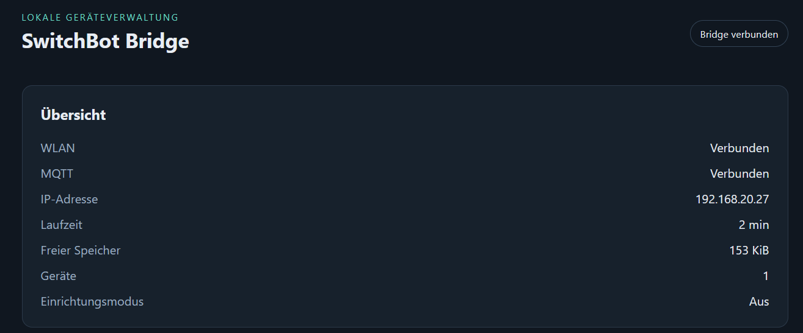
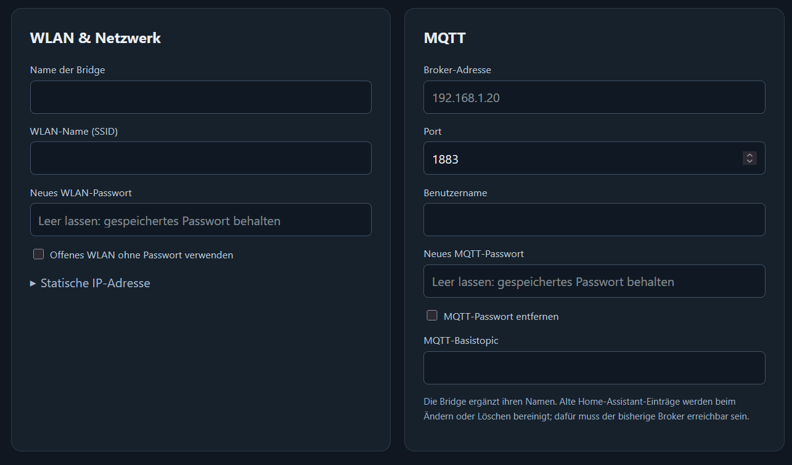

# SwitchBot-MQTT-BLE-ESP32

Control SwitchBot devices locally over Bluetooth LE using an ESP32 and an MQTT broker. No SwitchBot Hub or cloud connection is required. Home Assistant MQTT Discovery is included; other MQTT-capable systems can use the topics below.

This is the **dstoeckler fork**, based on devWaves' v7.1 firmware, with AI-assisted fixes and additions. Original author: **devWaves**; upstream contributors include HardcoreWR and vin-w. The original project builds on combatistor's ESP32 BLE Gateway. This is an unofficial SwitchBot integration.

## What this fork adds

- A local browser interface for persistent WiFi, MQTT and device configuration, JSON import/export, password changes, restart and firmware upload.
- Protected setup WiFi and physical recovery through the BOOT button.
- Connection testing and automatic **configuration rollback** after unsuccessful changes.
- MQTT parsing checks, bounded BLE retries, scan timeouts and improved WiFi/MQTT recovery.
- Home Assistant entity naming without repeated device names, plus ESP32 uptime and diagnostic attributes.

See the [admin and USB migration guide (German)](docs/admin.md) and [validation notes](docs/validation.md). Build and host-side test results do not establish reliability on physical hardware; USB migration, BLE, network recovery and OTA still need hardware acceptance testing.

## Devices and boards

| Device type | Implemented functions |
| --- | --- |
| Bot | Press, on/off, mode and hold settings, optional password, status/settings queries |
| Curtain | Open, close, pause, position and status |
| Meter / Meter Plus | Temperature, humidity and battery telemetry |
| Contact Sensor | Contact, motion, light and entry/exit/button events |
| Motion Sensor | Motion and light telemetry |
| Plug Mini | On/off and telemetry |

These are device families implemented by the inherited protocol code, not a guarantee for every newer model or firmware. Historical upstream reports listed Bot v6.2, Curtain v4.6, Meter/Meter Plus v2.7, Contact v1.1, Motion v1.3 and Plug Mini v1.3; they are not fresh hardware test results for this fork.

The web configuration accepts **up to 16 devices**, with unique names and MAC addresses. Names are 1–32 letters, digits, underscores or hyphens and become part of MQTT topics. Stored configuration is limited to **3500 bytes**, so long credentials can reduce the number of devices that fit.

Use a Bluetooth-capable classic ESP32 with **at least 4 MB flash**. Verified PlatformIO build targets are `esp32dev` and `m5stack-atom`. Other entries in `platformio.ini` are historical board definitions, not a tested support matrix. ESP32-S2 has no Bluetooth; ESP32-C3/S3 are not validated with this project's pinned toolchain. BLE range and usable device capacity depend on placement and radio conditions.

## First installation with PlatformIO

**When migrating from the old firmware, flash over USB first. Do not upload this build through the old OTA page.** The admin firmware requires the supplied `partitions-admin.csv`, with two `0x1e0000`-byte OTA slots. A normal PlatformIO USB upload writes the partition table as well as the firmware.

Run these commands from the repository root with Python 3 installed:

```powershell
python -m pip install platformio==6.1.19
python -m platformio run -d "PlatformIO Files/SwitchBot-BLE2MQTT-ESP32" -e esp32dev
```

Connect the ESP32 by USB and upload, selecting the environment matching your board (`m5stack-atom` for that target):

```powershell
python -m platformio run -d "PlatformIO Files/SwitchBot-BLE2MQTT-ESP32" -e esp32dev -t upload
python -m platformio device monitor -b 115200
```

Use `--upload-port COM5` or monitor `-p COM5`, substituting your actual port, if automatic selection is ambiguous. Close the serial monitor before another USB upload.

1. Open the serial monitor at **115200 baud** and reset the board. On first boot it prints the username `admin` and a random device-specific password. Keep it; there is no shared default password.
2. With the supplied WiFi placeholders, connect to the protected **`SwitchBot-XXXX`** network using that admin password. Open **`http://192.168.4.1/`**. No web login is required by default. If WiFi is already configured, open the ESP32's LAN IP instead. Setup WiFi also starts after 60 seconds without a WiFi connection.
3. Enter WiFi and MQTT settings and add devices with their BLE MAC addresses. An empty MQTT username selects anonymous broker authentication. Routine setup does not require editing firmware source.
4. Save. The ESP32 restarts and tests the candidate configuration: WiFi and MQTT must connect within **75 seconds**, with MQTT connected for at least **five seconds**. BLE processing pauses during this test. On failure or an interrupted test, the previous configuration is restored.
5. Find the new IP in your router and reload the page. With Home Assistant MQTT integration configured, discovery is published after the configuration test succeeds.

Existing saved settings take precedence over compiled defaults. Advanced options such as mesh and scan policies remain in the source. The [admin guide](docs/admin.md) explains discovery cleanup, password handling and configuration limits.

### Arduino IDE

The standalone sketch is `Arduino IDE Files/SwitchBot-BLE2MQTT-ESP32.ino`; the admin interface is embedded. Use Arduino ESP32 core **1.0.6**, NimBLE-Arduino **1.4.0**, EspMQTTClient **1.13.3**, its PubSubClient dependency **2.8**, ArduinoJson **6.19.4** and ArduinoQueue **1.2.5**, matching the PlatformIO build. The current source implements Bot password CRC internally; the old separate CRC32 library instruction is no longer needed.

The Arduino build must also use **`PlatformIO Files/SwitchBot-BLE2MQTT-ESP32/partitions-admin.csv`**. Merely uploading the sketch with the old default partition scheme is insufficient. Arduino IDE installation and partition integration are not automated or verified here; PlatformIO is the verified build path.

## Local web frontend

The ESP32 serves its own responsive, offline interface at `http://<ESP32-IP>/`. All styles, scripts and translations are embedded in the firmware; no cloud service, CDN or separate frontend installation is needed.

- **German and English:** choose **Deutsch / English** in the header. The first visit follows the browser language (German for `de`, English otherwise). Your selection is remembered in that browser. Switching languages preserves unsaved form entries and does not restart the bridge.
- **Live overview:** Wi-Fi and MQTT connection state, IP address, uptime, free memory, configured device count and setup mode.
- **Network and MQTT:** configure Wi-Fi, DHCP/static IPv4, broker credentials, port, base topic and bridge name.
- **Devices:** manage up to 16 supported SwitchBot devices, set Bot entity types and passwords, and request status without operating a device.
- **Maintenance:** adjust scan intervals and retries, import/export JSON configuration, restart the bridge and upload compatible `.bin` firmware.
- **Optional login:** password protection is off by default. Enable it under **Administration → Enable password protection**, enter the new password twice, and save. The username is `admin`; the setting persists across restarts and protects the web interface, API and OTA uploads. You can disable it again in the same section.

Saving network/device settings restarts the bridge and tests connectivity, with automatic rollback on failure. Language selection is a browser preference; it is not part of the exported device configuration. The setup Wi-Fi network still uses its own required access password as described above.

The screenshots below show the German interface on a running bridge.

### Connection overview



### Wi-Fi and MQTT settings



## Administration and updates

Open `http://<ESP32-IP>/` to manage the bridge. Configuration survives reboot and compatible firmware updates. Exports omit stored passwords; when restoring to another ESP32, re-enter credentials. In the web form, an empty password field retains the existing value; use its explicit removal checkbox to clear it.

Web login is disabled by default, including after upgrading from firmware without the optional-login setting. Enable it under Administration by selecting password protection, entering a password (12–63 characters) twice and saving. The username is `admin`. The setting persists across restarts and applies to admin access and OTA. Uncheck and save to disable it. Writes always require the interface's session token. HTTP Basic and MQTT are unencrypted, so use a trusted local network without public port forwarding.

After the initial USB migration, build for the same board and partition layout and upload the application image through the admin interface:

```text
PlatformIO Files/SwitchBot-BLE2MQTT-ESP32/.pio/build/<environment>/firmware.bin
```

Upload `firmware.bin`, not a bootloader or partition-table image. OTA is blocked during configuration testing or a pending restart. A successful upload reboots the bridge; rejected, failed or aborted uploads do not intentionally reboot it. Configuration rollback is not a promise of automatic rollback from a faulty firmware image.

For forgotten credentials, open the serial monitor, reset the ESP32 and hold **BOOT for three seconds after** the `Admin setup: hold BOOT ...` message. The firmware prints a new password and opens setup WiFi without deleting device configuration. Holding BOOT before power-on can enter ROM flashing mode instead. Recovery uses GPIO0; see the [admin guide](docs/admin.md) for boards without that button.

## MQTT reference

For a single bridge, `<base>` means `<mqtt_main_topic>/<host>`, by default **`switchbot/esp32`**. `<name>` is the configured device name, not its MAC address. Text commands below are plain MQTT payloads without surrounding JSON quotes. Do not retain action commands, since a later subscription can replay them.

### Device commands

| Topic | Payload |
| --- | --- |
| `<base>/bot/<name>/set` | `PRESS`, `ON`, `OFF`; integer `0`–`100` to set hold seconds |
| `<base>/bot/<name>/set` | `MODEPRESS`, `MODESWITCH`, `MODEPRESSINV`, `MODESWITCHINV` |
| `<base>/bot/<name>/set` | `REQUESTSETTINGS` / `GETSETTINGS`, or `REQUESTINFO` / `GETINFO` |
| `<base>/curtain/<name>/set` | `OPEN`, `CLOSE`, `PAUSE`, integer `0`–`100`, or `REQUESTINFO` / `GETINFO` |
| `<base>/plug/<name>/set` | `ON`, `OFF` |
| `<base>/meter/<name>/set` | `REQUESTINFO` / `GETINFO` |
| `<base>/contact/<name>/set` | `REQUESTINFO` / `GETINFO` |
| `<base>/motion/<name>/set` | `REQUESTINFO` / `GETINFO` |

Bot hold values are the firmware's accepted input range; actual behavior depends on Bot firmware. `STATEON` and `STATEOFF` update assumed state only for Bots configured in the source's simulated ON/OFF-in-PRESS-mode map. This is not a physical state measurement. Bot settings responses require `getBotResponse = true`.

### Bridge commands

| Topic | Example JSON payload | Purpose |
| --- | --- | --- |
| `<base>/rescan` | `{"sec":30}` | Rescan for 1–300 seconds; digit strings such as `{"sec":"30"}` also work |
| `<base>/requestInfo` | `{"id":"switchbotone"}` | Request a configured device's information |
| `<base>/requestSettings` | `{"id":"switchbotone"}` | Read Bot settings; requires `getBotResponse = true` |
| `<base>/setHold` | `{"id":"switchbotone","hold":5}` | Set Bot hold duration |
| `<base>/holdPress` | `{"id":"switchbotone","hold":5}` | Set hold duration, then press without disconnecting between operations |
| `<base>/setMode` | `{"id":"switchbotone","mode":"MODESWITCH"}` | Set one of the four Bot modes listed above |

Example using Mosquitto clients (replace broker/device names and add broker credentials if required):

```sh
mosquitto_pub -h BROKER -t switchbot/esp32/bot/switchbotone/set -m PRESS
mosquitto_pub -h BROKER -t switchbot/esp32/rescan -m '{"sec":30}'
mosquitto_sub -h BROKER -t 'switchbot/esp32/#' -v
```

Retries are bounded. Device requests share a **20-second retry budget**, including nested connection/send retries; a BLE operation already in progress can finish after that deadline. The old claim of retrying until success or always making about 60 attempts no longer describes this fork.

### Published state and diagnostics

| Topic | Example payload / meaning |
| --- | --- |
| `<base>` | `{"status":"idle"}`, `{"status":"scanning"}`, `{"status":"boot"}`, `{"status":"controlling"}`, `{"status":"getsettings"}`; also bridge errors |
| `<base>/lastwill` | `online` / `offline` bridge availability |
| `<base>/<type>/<name>/status` | Command feedback, e.g. `{"status":"success","value":1,"command":"ON"}` or `{"status":"errorConnect","command":"ON"}` |
| `<base>/<type>/<name>/attributes` | Device-specific JSON: battery, RSSI, mode, temperature, humidity, position or sensor state |
| `<base>/bot/<name>/state`, `<base>/plug/<name>/state` | `ON` / `OFF` |
| `<base>/curtain/<name>/state` | Curtain state, e.g. `OPEN` / `CLOSE` |
| `<base>/curtain/<name>/position` | `{"pos":50}` |
| `<base>/bot/<name>/settings` | e.g. `{"firmware":4.9,"timers":0,"inverted":false,"hold":5}` |
| `<base>/motion/<name>/motion`, `<base>/contact/<name>/motion` | `MOTION` / `NO MOTION` |
| `<base>/contact/<name>/contact` | `OPEN` / `CLOSED` |
| `<base>/motion/<name>/illuminance`, `<base>/contact/<name>/illuminance` | `LIGHT` / `DARK` |
| `<base>/contact/<name>/in` | `ENTERED` / `IDLE` |
| `<base>/contact/<name>/out` | `EXITED` / `IDLE` |
| `<base>/contact/<name>/button` | `PUSHED` / `IDLE` |
| `<base>/esp32/systemUptime/state` | Uptime in hours, published by default every 60 seconds |
| `<base>/esp32/systemUptime/json_attr` | `uptime_ms`, `free_heap`, `wifi_rssi`; optional Bluetooth MAC |

Only applicable topics and fields are published for each device/configuration. State may be optimistic when corresponding source options are enabled. The uptime-hours sensor handles `millis()` wrap; the raw `uptime_ms` attribute still wraps. Home Assistant discovery uses `homeassistant` by default. Curtain light is a raw level, not lux.

## Multiple ESP32s and scanning

Mesh is an advanced source configuration; see the configuration examples in `Examples/`. Give every ESP32 a unique `host`; on secondary nodes set `meshHost` to the primary's host. Configure the same Meter, Motion and Contact devices on participating nodes. Configure each Bot, Curtain or Plug on only one nearby ESP32.

The mesh shares sensor data through MQTT, with the primary handling event counts and duplicate suppression. It is not a Bluetooth mesh. Sensor topics can use the primary's namespace rather than the single-bridge topic layout above.

Active scans request additional BLE responses; passive scans receive advertisements. Available data and battery impact depend on the device and scan policy. The firmware can interrupt scanning to process control commands. Extra timing and scan policies remain source settings.

With Home Assistant discovery enabled and an existing device/broker configuration, the admin interface blocks changes that require discovery cleanup on mesh nodes, including device, broker, hostname and topic changes. Such changes require coordinated migration across nodes. WiFi and polling settings remain configurable.

## Development and validation

The two standalone firmware variants must remain identical. Edit admin sources in `admin/` and run the generator instead of editing their embedded copies:

```powershell
python tools/sync_admin.py
python tools/sync_admin.py --check
python -m platformio run -d "PlatformIO Files/SwitchBot-BLE2MQTT-ESP32" -e esp32dev -e m5stack-atom
python -m unittest discover -s tests -v
```

Tests need `g++` on PATH. Codec/rollback tests additionally use ArduinoJson headers installed by PlatformIO and are skipped if these are missing. The workflow in `.gitea/workflows/` checks source consistency, tests and both build targets; it is a Gitea workflow, not a GitHub Actions workflow.

For a browser-only admin preview, run `python tools/preview_admin.py` and open `http://127.0.0.1:8765`. It simulates API responses and does not communicate with hardware. See [validation notes](docs/validation.md) and the [admin guide](docs/admin.md) for recorded checks and outstanding hardware tests.

## Credits and license

- Original project and author: [devWaves/SwitchBot-MQTT-BLE-ESP32](https://github.com/devWaves/SwitchBot-MQTT-BLE-ESP32).
- Earlier foundation: [combatistor/ESP32_BLE_Gateway](https://github.com/combatistor/ESP32_BLE_Gateway).
- Upstream contributors: HardcoreWR and vin-w.
- Fork maintenance and AI-assisted changes: dstoeckler.

Support this fork:

<a href="https://www.buymeacoffee.com/dstoeckler" target="_blank" rel="noopener noreferrer"></a>

Support the original author, devWaves:

<a href="https://www.buymeacoffee.com/devwaves" target="_blank" rel="noopener noreferrer"></a>

Licensed under the [MIT License](LICENSE). Historical upstream tutorials predate the admin interface and partition migration and should not be used as the installation procedure for this fork.
